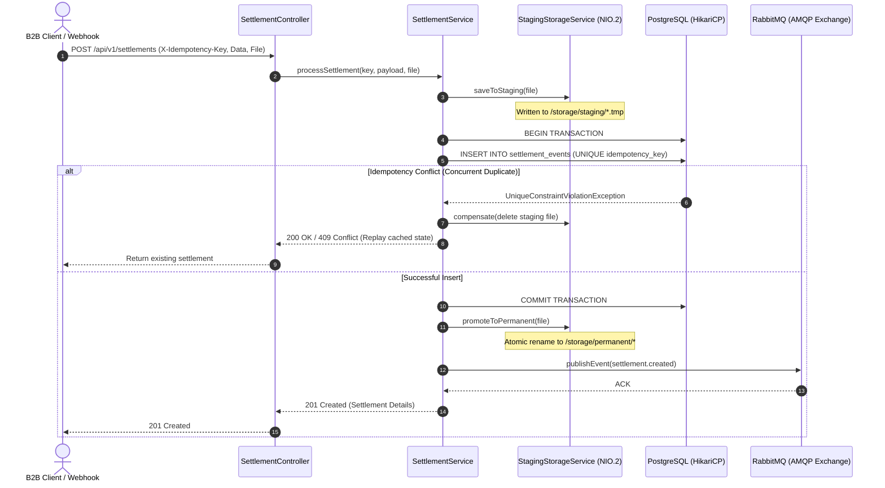

# 🌊 LedgerStream: Idempotent Event & Settlement Dispatcher

[](https://openjdk.org/projects/jdk/21/)
[](https://spring.io/projects/spring-boot)
[](https://www.postgresql.org/)
[](https://www.rabbitmq.com/)
[](LICENSE)

> A mission-critical financial settlement ingestion and dispatching engine designed to solve distributed consistency challenges in B2B SaaS platforms: **atomic idempotency barriers**, **two-phase transactional file staging with automatic compensation**, and **fault-tolerant asynchronous messaging**.

---

## 🎯 The Engineering Challenge

In distributed financial ecosystems (such as billing webhooks, payment gateways, and high-frequency B2B invoicing), network retries and concurrent client bursts regularly induce race conditions and data corruption:

1. **Duplicate Event Hazards:** Naive `SELECT ... INSERT` patterns fail under simultaneous concurrent requests, causing double-crediting or duplicate ledger entries.
2. **Physical I/O vs. Relational Mismatch:** Uploading physical receipts or proof-of-payment documents directly into permanent storage during an open SQL transaction risks leaving **orphan storage files** if the database transaction rolls back. Conversely, committing the database record before persisting the file risks missing mandatory attachments upon storage failure.
3. **Downstream Unavailability:** Partner APIs and message brokers experience transient network partitions. Dispatching operations must withstand latency spikes without blocking HTTP worker threads.

---

## 🏛️ Architecture & Solution Design



### Implemented in Phase 1 (Foundation & Contracts)
- **Strict Idempotency Barrier (Schema):** Enforced directly in PostgreSQL via `UNIQUE (idempotency_key)` and SHA-256 payload checksum comparison.
- **Contract-First Documentation:** Complete REST specification modeled in [docs/openapi.yaml](docs/openapi.yaml).
- **Relational Integrity:** Initial Flyway migrations set up cascade constraints and tables for audit logs.

### Planned for Phase 2 (Business Logic & Resilience)
- **Two-Phase Compensating Storage:** Physical attachments will be staged in temporary storage (`java.nio.file`) isolated from the transactional lifecycle, and automatically rolled back on database failure.
- **Asynchronous AMQP Dispatcher:** Will offload event notification to RabbitMQ with configured Dead-Letter Exchanges (DLX), exponential backoff retries, and Circuit Breaker isolation via Resilience4j.
- **Strict Idempotency Execution:** Java implementation for conflict handling and safe duplicate replays.

---

## 🚀 Quick Start (Local Reproduction)

### Prerequisites
- **Docker & Docker Compose** (tested on Docker Engine 24+)
- **Java 21** & **Maven 3.9+** (optional if using containerized execution)

### 1. Spin up Infrastructure (PostgreSQL 16 & RabbitMQ)
```bash
docker compose up -d
```

Verify that services are running and healthy (Wait for startup completion):
```bash
docker compose ps
```
- **PostgreSQL:** `localhost:5432` (DB: `ledgerstream`, User: `ledger`)
- **RabbitMQ Management UI:** [http://localhost:15672](http://localhost:15672) (User: `guest` / `guest`)

### 2. Build the Application
```bash
./mvnw clean compile
```

---

## 🧪 Testing Strategy (Planned for Phase 2)

The test suite will prioritize high-risk failure scenarios:
- **Multithreaded Concurrency Tests:** Simulates 50 simultaneous threads issuing identical requests to verify zero duplicate records and thread confinement.
- **Rollback Compensation Verification:** Forces artificial database constraints to prove physical staging files are deleted without leaving storage orphans.
- **Full-Stack Integration:** Uses **Testcontainers** to dynamically spin up isolated PostgreSQL and RabbitMQ instances during `mvn test`.

Run tests locally:
```bash
./mvnw test
```

---

## 📋 API Specification Summary

| Method | Endpoint | Description | Idempotent |
| :--- | :--- | :--- | :---: |
| `POST` | `/api/v1/settlements` | Ingest new settlement (Multipart: JSON + file) | ✅ (`X-Idempotency-Key`) |
| `GET` | `/api/v1/settlements/{id}` | Fetch settlement by internal ID | ✅ |
| `GET` | `/api/v1/settlements/idempotency/{key}` | Fetch settlement by Idempotency Key | ✅ |
| `GET` | `/api/v1/settlements/{id}/audit` | Retrieve immutable audit history | ✅ |

Refer to [`docs/openapi.yaml`](docs/openapi.yaml) for full request/response schemas and examples.

---

## 🛡️ Originality & Engineering Disclosure

*This is an independent open-source project with self-contained, original requirements designed to showcase advanced software engineering patterns (concurrency safety, transaction compensation, event-driven resilience, and automated verification). It does not reproduce business rules, proprietary code, or data models from any current or past employer.*
